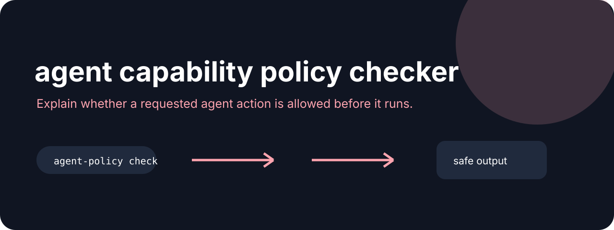

# Agent Policy



**Explain whether a requested agent action is allowed before it runs.**

[](https://github.com/jonah-ux/agent-policy/actions/workflows/ci.yml)
[](https://www.python.org/)
[](LICENSE)

Agent Policy evaluates a JSON request against explicit allow rules and returns a compact,
machine-readable allow or deny decision. It defaults to deny when no rule matches, making the
decision visible before a command or capability is handed to an agent.

## Try it in 30 seconds

```bash
python -m pip install git+https://github.com/jonah-ux/agent-policy.git@main
python demos/demo.py
```

The smallest useful policy and request look like this:

```json
{"allow":[{"kind":"command","pattern":"git status"}]}
```

```json
{"kind":"command","value":"git status"}
```

```bash
agent-policy check request.json --policy policy.json
```

## See it work

The demo makes the decision and its reason explicit before a caller acts:

```json
{"schema":"agent-policy/v1","decision":"allow","allowed":true,"kind":"command","value":"git status","reason":"matching rule"}
```

## Related tools

Pair [Agent Policy](https://github.com/jonah-ux/agent-policy) with [Agent Sandbox Run](https://github.com/jonah-ux/agent-sandbox-run) for execution receipts, [Agent Proof](https://github.com/jonah-ux/agent-proof) for evidence, and [MCP Doctor](https://github.com/jonah-ux/mcp-doctor) for tool-contract checks.

The output uses the `agent-policy/v1` schema and exits `0` for an allowed request or `1` for a
denied request, so a shell, CI job, or agent can stop before acting.

## Development

```bash
python -m unittest discover -s tests
python -m build --sdist --wheel
python demos/demo.py
```

This is a policy decision helper, not an operating-system sandbox. Enforce the decision in the
caller that owns the action.

MIT licensed.
