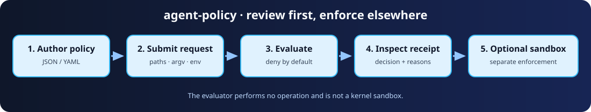

# agent-policy

[](https://github.com/jonah-ux/agent-policy/actions/workflows/ci.yml)

A small, standalone Python 3.11+ CLI for reviewing agent operations against an explicit, deny-by-default JSON (or optional YAML) policy. It handles paths, commands, environment variables, network destinations, and Git operations. Every decision includes an inspectable receipt when requested.

> This is a policy evaluator, not a kernel sandbox. It does not intercept, authorize, or prevent operating-system calls. Use a platform sandbox such as bubblewrap, containers, or a VM when enforcement is required.



## Install

```console
git clone https://github.com/jonah-ux/agent-policy.git
cd agent-policy
python3 -m venv .venv
. .venv/bin/activate
python3 -m pip install .
agent-policy --help
```

The checkout install above is the reproducible source path. No runtime dependencies are required.

No runtime dependencies are required. YAML input is optional: `python3 -m pip install '.[yaml]'` from the checkout. Platform sandbox helpers are optional and never invoked by this package.

## Quick start

A policy has exactly `version`, `default: deny`, and `rules`. See [`examples/policy.json`](examples/policy.json) and [`examples/request.json`](examples/request.json).

```console
$ agent-policy dry-run --policy examples/policy.json --request examples/request.json --receipt
{
  "mode": "dry-run",
  "notice": "This evaluates policy; it is not a kernel sandbox and does not enforce system operations.",
  "performed": false,
  "receipt_version": 1,
  "result": {
    "decision": "deny",
    ...
  },
  "tool": "agent-policy"
}
```

Exit status is `0` only when every operation is allowed, `1` when any operation is denied, and `2` for malformed input. `check` emits only the aggregate decision; `explain` emits rule matches and reasons; `dry-run` makes the non-execution mode explicit. None of these commands perform the requested operation.

Operations are exact structured data, not shell strings. For commands, the first argv item is matched against `commands`; optional `argv_patterns` match the complete argv. Paths and Git repository identifiers are workspace-relative and reject absolute paths, home paths, NUL bytes, and `..` components. The evaluator never expands variables, follows symlinks, or resolves a filesystem path.

## Compose and audit decisions

Use `compose` to combine policy layers in an explicit order before handing the result to an evaluator:

```console
agent-policy compose --policy baseline.json --policy workspace.json > effective-policy.json
```

Every layer is validated with the same strict schema. Duplicate rule IDs are rejected with exit status `2`, so a later layer cannot silently replace an earlier rule. Evaluation keeps the deny-by-default and explicit-deny precedence rules after composition.

`explain` and `dry-run --receipt` include SHA-256 identities for the normalized policy and request, the normalized rule count, each matching rule's position, and a `decision_source` (`explicit_allow`, `explicit_deny`, or `default_deny`). Digests identify the reviewed inputs without copying policy contents, command arguments, or other potentially sensitive values into a receipt.

## Open the policy walkthrough

The [policy decision walkthrough](docs/walkthrough.html) is a standalone, dependency-free
tour of the deny-by-default flow. Click an operation to inspect its matching rule, decision source,
and receipt-shaped explanation. The fixture is synthetic and browser-only; the command panel gives
you the exact local reproduction path. It is a policy tour, not a magic wand for the operating
system — bring a sandbox when you need enforcement.

## Related tools

Pair [Agent Policy](https://github.com/jonah-ux/agent-policy) with [Agent Sandbox Run](https://github.com/jonah-ux/agent-sandbox-run) for execution receipts, [Agent Proof](https://github.com/jonah-ux/agent-proof) for evidence, and [MCP Doctor](https://github.com/jonah-ux/mcp-doctor) for tool-contract checks.

## Development

```console
python3 -m venv .venv
. .venv/bin/activate
python -m pip install -e '.[dev]'
pytest
python -m build
```

Fixtures are synthetic and contain no credentials or live network calls. See [`SECURITY.md`](SECURITY.md) for the threat model and [`CONTRIBUTING.md`](CONTRIBUTING.md) for changes.

## License

MIT. See [`LICENSE`](LICENSE).
